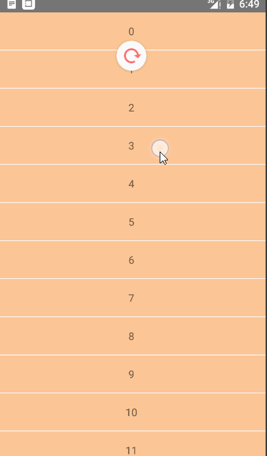
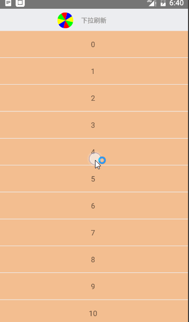

## RecyclerView 下拉刷新和上拉加载

RecyclerView已经出来很久了，许许多多的项目都开始从ListView转战RecyclerView，那么，上拉加载和下拉刷新是一件很有必要的事情。

在ListView上，我们可以通过自己添加`addHeadView`和`addFootView`去添加头布局和底部局实现自定义的上拉和下拉，或者使用一些第三方库来简单的集成，例如`android-pulltorefresh`或者`android-Ultra-Pull-to-Refresh`，后者的自定义更强，但需要自己实现上拉加载。

而在下面我们将用两种方式来实现上拉加载和下拉刷新

- `SwipeRefreshLayout`+滑动底部自动加载

- 使用第三方库`SwipeToLoadLayout`实现上拉加载和下拉刷新。

### **`SwipeRefreshLayout`+滑动底部自动加载**

SwipeRefreshLayout实现很简单，重点是滑动到底部自动加载应该如何实现，其实其实现的方式类似于`ListView`的实现方式。

看一下`activity_recycle_swiperefresh.xml`文件：


```java 
<android.support.v4.widget.SwipeRefreshLayout xmlns:android="http://schemas.android.com/apk/res/android"
    android:id="@+id/swipe_refresh"
    android:orientation="vertical" android:layout_width="match_parent"
    android:layout_height="match_parent">

    <android.support.v7.widget.RecyclerView
        android:id="@+id/swipe_target"
        android:layout_width="match_parent"
        android:layout_height="wrap_content"
        android:scrollbars="none" />

</android.support.v4.widget.SwipeRefreshLayout>

```
布局文件就两个控件，`SwipeRefreshLayout`中嵌套`RecyclerView`。


在代码中初始化`RecyclerView`以及实现`adapter`等，这不是重点，不再贴代码。

在`RecyclerView`中有方法`addOnScrollListener`，该方法类似于`ListView`的`setOnScrollListener`方法，`OnScrollListener`中有两个方法的回调

- `onScrolled(RecyclerView recyclerView, int dx, int dy)` ：滚动的回调，dx和dy表示手指滑动水平和垂直的偏移量。

- `onScrollStateChanged(RecyclerView recyclerView, int newState)`：滑动状态的回调。

那么，我们的着重点就在这个两个方法上了。

对于向上加载更多，我们需要有如下判断

- 是否是向上滑动
- 是否滑动到底部
- 当前是否正在加载数据
- 当前状态是否是滑动停止的状态

实现比较复杂，定义一个类`LoadDataScrollController`，继承类`RecyclerView.OnScrollListener`，

因为`onScrollStateChanged`实在状态改变时的回调，无法时时的获取显示的条目以及位置，所以我们在`onScrolled`中获取相应位置，

```java 
  @Override
    public void onScrolled(RecyclerView recyclerView, int dx, int dy) {

        /**
         * 获取布局参数
         */
        RecyclerView.LayoutManager layoutManager = recyclerView.getLayoutManager();

        //如果为null，第一次运行，确定布局类型
        if (mLayoutManagerType == null) {
            if (layoutManager instanceof LinearLayoutManager) {
                mLayoutManagerType = LayoutManagerType.LINEAR_LAYOUT;
            } else if (layoutManager instanceof GridLayoutManager) {
                mLayoutManagerType = LayoutManagerType.GRID_LAYOUT;
            } else if (layoutManager instanceof StaggeredGridLayoutManager) {
                mLayoutManagerType = LayoutManagerType.STAGGERED_GRID_LAYOUT;
            } else {
                throw new RuntimeException("LayoutManager should be LinearLayoutManager,GridLayoutManager,StaggeredGridLayoutManager");
            }
        }

        //对于不太能够的布局参数，不同的方法获取到当前显示的最后一个条目数
        switch (mLayoutManagerType) {
            case LINEAR_LAYOUT:
                mLastVisibleItemPosition = ((LinearLayoutManager) layoutManager).findLastVisibleItemPosition();
                break;
            case GRID_LAYOUT:
                mLastVisibleItemPosition = ((GridLayoutManager) layoutManager).findLastVisibleItemPosition();
                break;
            case STAGGERED_GRID_LAYOUT:
                StaggeredGridLayoutManager staggeredGridLayoutManager = (StaggeredGridLayoutManager) layoutManager;
                if (mLastPostions == null) {
                    mLastPostions = new int[staggeredGridLayoutManager.getSpanCount()];
                }
                staggeredGridLayoutManager.findLastVisibleItemPositions(mLastPostions);
                mLastVisibleItemPosition = findMax(mLastPostions);
                break;
            default:
                break;
        }

    }

```

首先获取布局管理器，并判断是那种类型的，因为有三种类型，定义枚举来保存布局类型的参数
```java 
/**
 *
 * RecycleView的布局管理器的类型
 * Created by Alex_MaHao on 2016/5/10.
 */
public enum  LayoutManagerType {
    LINEAR_LAYOUT,
    GRID_LAYOUT,
    STAGGERED_GRID_LAYOUT
}
```

然后根据布局惯例其的类型获取其当前显示的最大条目，对于瀑布流来说，他如果是垂直的两列瀑布的话，我们需要获取两列中分别最大条目数，进行比较，选出最大条目数。

```java 
   /**
     * 当是瀑布流时，获取到的是每一个瀑布最下方显示的条目，通过条目进行对比
     */
    private int findMax(int[] lastPositions) {
        int max = lastPositions[0];
        for (int value : lastPositions) {
            if (value > max) {
                max = value;
            }
        }
        return max;
    }

```

拿到当前最大的条目数之后，在`onScrollStateChange`中进行判断状态等，

```java 
 @Override
    public void onScrollStateChanged(RecyclerView recyclerView, int newState) {

        RecyclerView.LayoutManager layoutManager = recyclerView.getLayoutManager();

        //RecycleView 显示的条目数
        int visibleCount = layoutManager.getChildCount();

        //显示数据总数
        int totalCount = layoutManager.getItemCount();


        // 四个条件，分别是是否有数据，状态是否是滑动停止状态，显示的最大条目是否大于整个数据（注意偏移量），是否正在加载数据
        if(visibleCount>0
                &&newState==RecyclerView.SCROLL_STATE_IDLE
                &&mLastVisibleItemPosition>=totalCount-1
                &&!isLoadData){
            //可以加载数据
           isLoadData = true;
        }

    }

```

注释很清楚，在加载数据的地方，我们将`isLoadData`设为`true`，同时利用接口回调加载数据，等数据加载完成，通过`setLoadDataStatus`方法设置为`false`

```java 
   public void setLoadDataStatus(boolean isLoadData){
        this.isLoadData = isLoadData;
    }

```


如果这样就结束了，感觉很麻烦，对于刷新和加载更多，我们需要在调用的地方分别设置监听，那么我们可以让`LoadDataScrollController`实现`SwipeRefreshLayout`的刷新监听方法，在利用我们定义的统一的上拉刷新和加载数据接口进行处理

```java 
/**
 * 实现上拉加载的监听：加载条件：滑动到最后，且是停止状态，则开始加载数据
 * Created by Alex_MaHao on 2016/5/10.
 */
public  class LoadDataScrollController extends RecyclerView.OnScrollListener implements SwipeRefreshLayout.OnRefreshListener {

    /**
     * 当前布局管理器的类型
     */
    private LayoutManagerType mLayoutManagerType;


    /**
     * 当前RecycleView显示的最大条目
     */
    private int mLastVisibleItemPosition;


    /**
     * 每列的最后一个条目
     */
    private int[] mLastPostions;


    /**
     * 是否正在加载数据  包括刷新和向上加载更多
     */
    private boolean isLoadData = false;


    /**
     * 回调接口
     */
    private OnRecycleRefreshListener mListener;


    public LoadDataScrollController(OnRecycleRefreshListener onRecycleRefreshListener) {
        this.mListener = onRecycleRefreshListener;
    }

    @Override
    public void onScrolled(RecyclerView recyclerView, int dx, int dy) {

        /**
         * 获取布局参数
         */
        RecyclerView.LayoutManager layoutManager = recyclerView.getLayoutManager();

        //如果为null，第一次运行，确定布局类型
        if (mLayoutManagerType == null) {
            if (layoutManager instanceof LinearLayoutManager) {
                mLayoutManagerType = LayoutManagerType.LINEAR_LAYOUT;
            } else if (layoutManager instanceof GridLayoutManager) {
                mLayoutManagerType = LayoutManagerType.GRID_LAYOUT;
            } else if (layoutManager instanceof StaggeredGridLayoutManager) {
                mLayoutManagerType = LayoutManagerType.STAGGERED_GRID_LAYOUT;
            } else {
                throw new RuntimeException("LayoutManager should be LinearLayoutManager,GridLayoutManager,StaggeredGridLayoutManager");
            }
        }

        //对于不太能够的布局参数，不同的方法获取到当前显示的最后一个条目数
        switch (mLayoutManagerType) {
            case LINEAR_LAYOUT:
                mLastVisibleItemPosition = ((LinearLayoutManager) layoutManager).findLastVisibleItemPosition();
                break;
            case GRID_LAYOUT:
                mLastVisibleItemPosition = ((GridLayoutManager) layoutManager).findLastVisibleItemPosition();
                break;
            case STAGGERED_GRID_LAYOUT:
                StaggeredGridLayoutManager staggeredGridLayoutManager = (StaggeredGridLayoutManager) layoutManager;
                if (mLastPostions == null) {
                    mLastPostions = new int[staggeredGridLayoutManager.getSpanCount()];
                }
                staggeredGridLayoutManager.findLastVisibleItemPositions(mLastPostions);
                mLastVisibleItemPosition = findMax(mLastPostions);
                break;
            default:
                break;
        }

    }

    @Override
    public void onScrollStateChanged(RecyclerView recyclerView, int newState) {

        RecyclerView.LayoutManager layoutManager = recyclerView.getLayoutManager();

        //RecycleView 显示的条目数
        int visibleCount = layoutManager.getChildCount();

        //显示数据总数
        int totalCount = layoutManager.getItemCount();


        // 四个条件，分别是是否有数据，状态是否是滑动停止状态，显示的最大条目是否大于整个数据（注意偏移量），是否正在加载数据
        if(visibleCount>0
                &&newState==RecyclerView.SCROLL_STATE_IDLE
                &&mLastVisibleItemPosition>=totalCount-1
                &&!isLoadData){
            //可以加载数据
          if(mListener!=null){
              isLoadData = true;
              mListener.loadMore();
          }
        }

    }


    /**
     * 当是瀑布流时，获取到的是每一个瀑布最下方显示的条目，通过条目进行对比
     */
    private int findMax(int[] lastPositions) {
        int max = lastPositions[0];
        for (int value : lastPositions) {
            if (value > max) {
                max = value;
            }
        }
        return max;
    }


    public void setLoadDataStatus(boolean isLoadData){
        this.isLoadData = isLoadData;
    }

    @Override
    public void onRefresh() {
        //刷新数据的方法
        if(mListener!=null){
            isLoadData = true;
            mListener.refresh();
        }

    }

    /**
     * 数据加载接口回调
     */
    interface OnRecycleRefreshListener{
        void refresh();
        void loadMore();
    }
}

```

最后看一下main的代码
```java 
/**
 * 使用原生的SwipeRefreshLayout和代码判断
 *      实现RecyclewView 的刷新和加载更多
 *
 * Created by Alex_MaHao on 2016/5/10.
 */
public class SwipeRefreshActivity extends AppCompatActivity implements LoadDataScrollController.OnRecycleRefreshListener {


    private SwipeRefreshLayout mSwipeRefresh;

    private RecyclerView mRecycle;

    private HomeAdapter mAdapter;

    private LoadDataScrollController mController;


    private ProgressDialog pd;

    @Override
    protected void onCreate(@Nullable Bundle savedInstanceState) {
        super.onCreate(savedInstanceState);

        setContentView(R.layout.activity_recycle_swiperefresh);

        mRecycle = ((RecyclerView) findViewById(R.id.swipe_target));

        mSwipeRefresh = ((SwipeRefreshLayout) findViewById(R.id.swipe_refresh));

        mSwipeRefresh.setColorSchemeColors(Color.RED,Color.GREEN,Color.BLUE);

        /**
         * 创建控制器，同时使当前activity实现数据监听回调接口
         */
        mController = new LoadDataScrollController(this);


        mAdapter = new HomeAdapter();

        //设置垂直的线性布局管理器，Orientation -->   VERTICAL:垂直   HORIZONTAL:水平
        LinearLayoutManager layoutManager = new LinearLayoutManager(this);
        layoutManager.setOrientation(LinearLayoutManager.VERTICAL);

        //StaggeredGridLayoutManager layoutManager = new StaggeredGridLayoutManager(2,StaggeredGridLayoutManager.VERTICAL);

        //添加分割线
        mRecycle.addItemDecoration(new DividerItemDecoration(getApplicationContext(), DividerItemDecoration.VERTICAL_LIST));


        mRecycle.setLayoutManager(layoutManager);

        mRecycle.setItemAnimator(new DefaultItemAnimator());

        mRecycle.setAdapter(mAdapter);

        mAdapter.refresh();

        /**
         * 设置监听
         */
        mRecycle.addOnScrollListener(mController);

        mSwipeRefresh.setOnRefreshListener(mController);

    }

    @Override
    public void refresh() {
        //刷新的接口调
        mSwipeRefresh.postDelayed(new Runnable() {
            @Override
            public void run() {
                mAdapter.refresh();
                mSwipeRefresh.setRefreshing(false);
                mController.setLoadDataStatus(false);
            }
        },2000);
    }

    @Override
    public void loadMore() {
        //加载更多的接口回调
        pd = new ProgressDialog(this);
        pd.show();
        mSwipeRefresh.postDelayed(new Runnable() {
            @Override
            public void run() {
                mAdapter.add();
                //设置数据加载结束的监听状态
                mController.setLoadDataStatus(false);
                pd.dismiss();
            }
        },2000);
    }
}

```

贴个效果图




### **`SwipeToLoadLayout`实现上拉加载和下拉刷新**

该刷新控件的方式类似于`Ultra-pull-to-refresh`的使用方式。

如下方式添加该库：

```java 
 repositories {
        maven { url "https://jitpack.io" }
           }

 compile 'com.github.Aspsine:SwipeToLoadLayout:1.0.3'

```

首先我们需要自定义一个头视图和底部视图，头部试图和底部试图的用法相同，所以我们先定义一个头部视图类：

```java 
/**
 * 基础的refreshHeadView
 */
public class RefreshHeaderView extends TextView implements SwipeRefreshTrigger, SwipeTrigger {

    public RefreshHeaderView(Context context) {
        super(context);
    }

    public RefreshHeaderView(Context context, AttributeSet attrs) {
        super(context, attrs);
    }

    public RefreshHeaderView(Context context, AttributeSet attrs, int defStyleAttr) {
        super(context, attrs, defStyleAttr);
    }

    @TargetApi(Build.VERSION_CODES.LOLLIPOP)
    public RefreshHeaderView(Context context, AttributeSet attrs, int defStyleAttr, int defStyleRes) {
        super(context, attrs, defStyleAttr, defStyleRes);
    }

    @Override
    public void onRefresh() {
        //下拉到一定位置松开之后，调用此方法
        setText("refresh");

        Log.i("info","onRefresh");
    }

    @Override
    public void onPrepare() {

        //下拉之前调用此方法
        Log.i("info","onPrepare");
    }

    @Override
    public void onMove(int yScrolled, boolean isComplete, boolean automatic) {
        if (!isComplete) {
            //当前Y轴偏移量大于控件高度时，标识下拉到界限，显示“松开已刷新”
            if (yScrolled >= getHeight()) {

            } else {
                //未达到偏移量

            }
        } 
        Log.i("info","onMove");
    }

    @Override
    public void onRelease() {
        //达到一定滑动距离，松开刷新时调用
        setText("onRelease");
        Log.i("info","onRelease");
    }

    @Override
    public void onComplete() {
        //加载完成之后调用此方法
        setText("complete");
        Log.i("info","onComplete");
    }

    @Override
    public void onReset() {
        //重置
        setText("onReset");
        Log.i("info","onReset");
    }
}

```

其需要实现接口`SwipeRefreshTrigger`和`SwipeTrigger`。

而底部需要实现`SwipeTrigger`和`SwipeLoadMoreTrigger`。


布局文件中如下使用
```java 

<RelativeLayout xmlns:android="http://schemas.android.com/apk/res/android"
    xmlns:tools="http://schemas.android.com/tools"
    android:layout_width="match_parent"
    android:layout_height="match_parent"
    android:background="#ECEDF0"
    >

    <com.aspsine.swipetoloadlayout.SwipeToLoadLayout
        android:id="@+id/swipeToLoadLayout"
        android:layout_width="match_parent"
        android:layout_height="match_parent">

        <com.mahao.alex.systemwidgetdemo.recycleView.swipetoloadlayout.RefreshHeaderView
            android:id="@+id/swipe_refresh_header"
            android:layout_width="match_parent"
            android:layout_height="wrap_content" />

        <android.support.v7.widget.RecyclerView
            android:id="@+id/swipe_target"
            android:layout_width="match_parent"
            android:layout_height="wrap_content"
            android:scrollbars="vertical" />

        <com.mahao.alex.systemwidgetdemo.recycleView.swipetoloadlayout.LoaderMoreView
            android:id="@+id/swipe_load_more_footer"
            android:layout_width="match_parent"
            android:layout_height="wrap_content"
            android:gravity="center"
            android:padding="20dp" />
    </com.aspsine.swipetoloadlayout.SwipeToLoadLayout>


</RelativeLayout>

```

查找控件，设置监听

```java 
 		swipeToLoadLayout.setOnRefreshListener(this);
        swipeToLoadLayout.setOnLoadMoreListener(this);
```

在我们之前的代码中，加入了log信息，我们可以看一下log信息。...代表多次`onMove()`方法多次调用。

```java 
05-10 10:30:34.396 23814-23814/com.mahao.alex.systemwidgetdemo I/info: onPrepare
05-10 10:30:34.536 23814-23814/com.mahao.alex.systemwidgetdemo I/info: onMove
..........................................................................
05-10 10:30:34.886 23814-23814/com.mahao.alex.systemwidgetdemo I/info: onMove
05-10 10:30:34.896 23814-23814/com.mahao.alex.systemwidgetdemo I/info: onRelease
05-10 10:30:34.906 23814-23814/com.mahao.alex.systemwidgetdemo I/info: onMove
..........................................................................
05-10 10:30:35.086 23814-23814/com.mahao.alex.systemwidgetdemo I/info: onMove
05-10 10:30:35.106 23814-23814/com.mahao.alex.systemwidgetdemo I/info: onRefresh
05-10 10:30:37.116 23814-23814/com.mahao.alex.systemwidgetdemo I/info: onComplete
05-10 10:30:37.416 23814-23814/com.mahao.alex.systemwidgetdemo I/info: onMove
..........................................................................
05-10 10:30:37.516 23814-23814/com.mahao.alex.systemwidgetdemo I/info: onMove
05-10 10:30:37.916 23814-23814/com.mahao.alex.systemwidgetdemo I/info: onReset
```

首先会调用`onPrepare()方法`，`onMove()`方法会一直调用,只要视图有偏移，就会调用。下拉到一定距离之后，松开调用`onRelaease()`,回归到刷新位置时回调`onRefresh()`，加载完成调用`onComplete()`，视图开始缩小，最后隐藏之后调用`onReset()`


根据需求自定义视图，




定义我们的椭圆,使用自定义控件

```java 
/**
 * CircleView 圆盘控件，可以旋转
 * Created by Alex_MaHao on 2016/5/10.
 */
public class CircleView extends View {

    /**
     * 控件的半径
     */
    private int mRadius;

    /**
     * 绘制弧形的画笔
     */
    private Paint mArcPaint;

    /**
     * 绘制弧形的区域
     */
    private RectF mRange;


    private int[] colors = {Color.RED, Color.BLUE, Color.YELLOW, Color.GREEN};

    public CircleView(Context context) {
        this(context, null, 0);
    }

    public CircleView(Context context, AttributeSet attrs) {
        this(context, attrs, 0);
    }

    public CircleView(Context context, AttributeSet attrs, int defStyleAttr) {
        super(context, attrs, defStyleAttr);

        init();
    }

    private void init() {
        mArcPaint = new Paint();
        mArcPaint.setAntiAlias(true);
        mArcPaint.setDither(true);
        mArcPaint.setStyle(Paint.Style.FILL);
    }

    @Override
    protected void onMeasure(int widthMeasureSpec, int heightMeasureSpec) {
        super.onMeasure(widthMeasureSpec, heightMeasureSpec);

        int width = 0;
        int height = 0;

        int widthSize = MeasureSpec.getSize(widthMeasureSpec);
        int widthMode = MeasureSpec.getMode(widthMeasureSpec);

        int heightSize = MeasureSpec.getSize(heightMeasureSpec);
        int heightMode = MeasureSpec.getMode(heightMeasureSpec);


        if (widthMode == MeasureSpec.EXACTLY) {
            width = widthSize;
        } else {
            width = (int) TypedValue.applyDimension(TypedValue.COMPLEX_UNIT_DIP, 45, getResources().getDisplayMetrics());
        }

        if (heightMode == MeasureSpec.EXACTLY) {
            height = heightSize;
        } else {
            height = (int) TypedValue.applyDimension(TypedValue.COMPLEX_UNIT_DIP, 45, getResources().getDisplayMetrics());
        }

        //获取半径
        mRadius = Math.min(width, height) / 2;
        /**
         * 设置宽高为固定值
         */
        setMeasuredDimension(mRadius * 2, mRadius * 2);

         mRange = new RectF(0, 0, mRadius * 2, mRadius * 2);
    }


    @Override
    protected void onDraw(Canvas canvas) {

        float degree = 360/colors.length/2f;

        for (int i = 0; i < 8; i++) {
            mArcPaint.setColor(colors[i%4]);
            canvas.drawArc(mRange,-90f+degree*i,degree,true,mArcPaint);
        }

    }
}

```

绘制头部刷新试图

```java 
**
 * 自定义的下拉刷新控件 头部
 * Created by Alex_MaHao on 2016/5/10.
 */
public class CircleRefreshHeaderView extends RelativeLayout implements SwipeTrigger, SwipeRefreshTrigger {

    CircleView mCircleView;

    TextView mDescText;

    private ObjectAnimator anim;

    private boolean isRelease;

    public CircleRefreshHeaderView(Context context) {
        this(context, null, 0);
    }

    public CircleRefreshHeaderView(Context context, AttributeSet attrs) {
        this(context, attrs, 0);
    }

    public CircleRefreshHeaderView(Context context, AttributeSet attrs, int defStyleAttr) {
        super(context, attrs, defStyleAttr);

        initView();
    }

    /**
     * 初始化布局
     */
    private void initView() {

        int circlewidth = (int) TypedValue.applyDimension(TypedValue.COMPLEX_UNIT_DIP, 30, getResources().getDisplayMetrics());

        mCircleView = new CircleView(getContext());

        LinearLayout.LayoutParams circleParams = new LinearLayout.LayoutParams(circlewidth,circlewidth);

        mCircleView.setLayoutParams(circleParams);

        mDescText = new TextView(getContext());

        LinearLayout.LayoutParams descParams = new LinearLayout.LayoutParams(circlewidth*3, ViewGroup.LayoutParams.WRAP_CONTENT);

        descParams.gravity = Gravity.CENTER;
        descParams.setMargins(circlewidth/2,0,0,0);
        mDescText.setLayoutParams(descParams);
        mDescText.setTextSize(12);
        mDescText.setTextColor(Color.GRAY);
        mDescText.setText("下拉刷新");

        //添加线性的父布局
        LinearLayout ll = new LinearLayout(getContext());
        RelativeLayout.LayoutParams llParams = new LayoutParams(ViewGroup.LayoutParams.WRAP_CONTENT, ViewGroup.LayoutParams.WRAP_CONTENT);
        llParams.addRule(CENTER_IN_PARENT);
        ll.setLayoutParams(llParams);
        ll.setPadding(10,10,10,10);

        ll.addView(mCircleView);
        ll.addView(mDescText);

        addView(ll);
    }

    @Override
    public void onRefresh() {

        //开始刷新，启动动画
        anim = ObjectAnimator.ofFloat(mCircleView, "rotation", mCircleView.getRotation(), mCircleView.getRotation()+360f)
                .setDuration(500);
        anim.setRepeatCount(ValueAnimator.INFINITE);
        anim.setRepeatMode(ValueAnimator.RESTART);
        anim.start();

        mDescText.setText("正在加载数据");
    }

    @Override
    public void onPrepare() {
        isRelease = false;
    }

    @Override
    public void onMove(int yScroll, boolean isComplete, boolean b1) {
        if (!isComplete) {
            if (yScroll < getHeight()) {
                mDescText.setText("下拉刷新");
            } else {
                mDescText.setText("松开刷新更多");
            }

            //如果是仍在下拉状态，则圆环跟随滑动进行滚动
            if (!isRelease)
                mCircleView.setRotation(((float) yScroll) / getHeight() * 360f);
        }


    }

    @Override
    public void onRelease() {
        isRelease = true;
    }

    @Override
    public void onComplete() {
        anim.cancel();
        mDescText.setText("加载完成");
    }

    @Override
    public void onReset() {
        //重置时，将动画置为初始状态
        mCircleView.setRotation(0f);
    }
}

```

布局文件

```xml 
<RelativeLayout xmlns:android="http://schemas.android.com/apk/res/android"
    xmlns:tools="http://schemas.android.com/tools"
    android:layout_width="match_parent"
    android:layout_height="match_parent"
    android:background="#ECEDF0"
    >

    <com.aspsine.swipetoloadlayout.SwipeToLoadLayout
        android:id="@+id/swipeToLoadLayout"
        android:layout_width="match_parent"
        android:layout_height="match_parent">

        <com.mahao.alex.systemwidgetdemo.recycleView.swipetoloadlayout.CircleRefreshHeaderView
            android:id="@+id/swipe_refresh_header"
            android:layout_width="match_parent"
            android:layout_height="wrap_content" />

        <android.support.v7.widget.RecyclerView
            android:id="@+id/swipe_target"
            android:layout_width="match_parent"
            android:layout_height="wrap_content"
            android:scrollbars="vertical" />

        <com.mahao.alex.systemwidgetdemo.recycleView.swipetoloadlayout.LoaderMoreView
            android:id="@+id/swipe_load_more_footer"
            android:layout_width="match_parent"
            android:layout_height="wrap_content"
            android:gravity="center"
            android:padding="20dp" />
    </com.aspsine.swipetoloadlayout.SwipeToLoadLayout>


</RelativeLayout>

```

```java 
public class SwipeToLayoutActivity extends AppCompatActivity implements OnRefreshListener, OnLoadMoreListener {


    private RecyclerView mRecycleView;

    SwipeToLoadLayout swipeToLoadLayout;

    private HomeAdapter adapter;


    @Override
    protected void onCreate(@Nullable Bundle savedInstanceState) {
        super.onCreate(savedInstanceState);
        setContentView(R.layout.activity_recycle_swipetolayout);


        swipeToLoadLayout = ((SwipeToLoadLayout) findViewById(R.id.swipeToLoadLayout));


        mRecycleView = ((RecyclerView) findViewById(R.id.swipe_target));


        adapter = new HomeAdapter();

        //设置垂直的线性布局管理器，Orientation -->   VERTICAL:垂直   HORIZONTAL:水平
        LinearLayoutManager layoutManager = new LinearLayoutManager(this);
        layoutManager.setOrientation(LinearLayoutManager.VERTICAL);

//        StaggeredGridLayoutManager layoutManager = new StaggeredGridLayoutManager(2,StaggeredGridLayoutManager.VERTICAL);

        //添加分割线
        mRecycleView.addItemDecoration(new DividerItemDecoration(getApplicationContext(), DividerItemDecoration.VERTICAL_LIST));

        mRecycleView.setLayoutManager(layoutManager);

        mRecycleView.setItemAnimator(new DefaultItemAnimator());

        mRecycleView.setAdapter(adapter);

        adapter.refresh();

        /**
         * 设置下拉刷新和上拉加载监听
         */
        swipeToLoadLayout.setOnRefreshListener(this);
        swipeToLoadLayout.setOnLoadMoreListener(this);

    }


    @Override
    public void onRefresh() {
        swipeToLoadLayout.postDelayed(new Runnable() {
            @Override
            public void run() {
                adapter.refresh();
                swipeToLoadLayout.setRefreshing(false);
            }
        },2000);
    }

    @Override
    public void onLoadMore() {
        swipeToLoadLayout.postDelayed(new Runnable() {
            @Override
            public void run() {

                adapter.add();
                swipeToLoadLayout.setLoadingMore(false);
            }
        },2000);
    }
}
```

OK。肯定有小伙伴使用该框架时一直报错，为什么，看框架的源码，有如下一段

```java 
 this.mHeaderView = this.findViewById(id.swipe_refresh_header);
 this.mTargetView = this.findViewById(id.swipe_target);
 this.mFooterView = this.findViewById(id.swipe_load_more_footer);
```

可以看出，作者是根据固定的id值获取的，所以在我们的布局文件中，必须使用固定的三个id。

如有需求，可移步[我的github](https://github.com/AlexSmille/alex_mahao_sample)获取源码。源码在systemwidgetdemo中。


